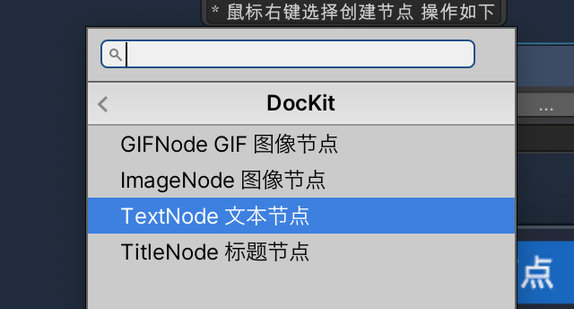
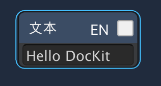

## 如何编辑文档?

### 0. 如何创建文本节点?

* 点击右键创建文本节点，操作如下

* 在打开的窗口中选择 DocKit/TextNode 文本节点 如下

* 结果如下

* 您可以在输入栏中随意输入编辑内容，笔者写的内容如下

* 这就是 DocKit 的文本节点创建流程，就介绍到这啦

### 1. 如何创建图像节点?

* 创建方式和文本节点一样，这里不再赘述，创建之后如下

* 点击  ... 按钮即可从桌面导入图片,所以在写文档时最好配合一个截图软件使用，导入之后如下。

* OK 图像节点的基本使用就介绍完啦，这里提醒一下，所有节点都支持中英文切换，这个功能如需使用，请自行体验.

* 图像节点 可能会造成很多不用的图像资源，所以提供了 一键清空无用资源的功能
* 使用方式 在 DocKit 文件的 Inspector 上点击 清空不用的图片源按钮即可。

* 如何修改图像节点的尺寸？ 修改原图图片文件的大小即可

