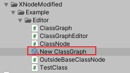
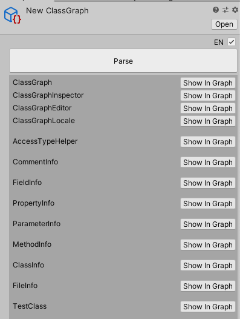
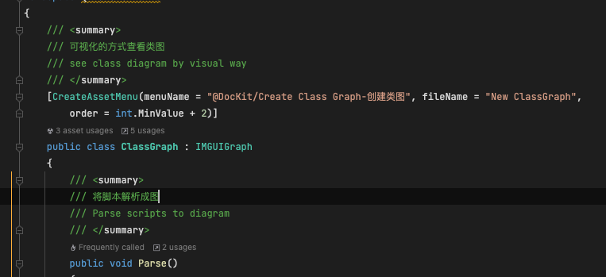
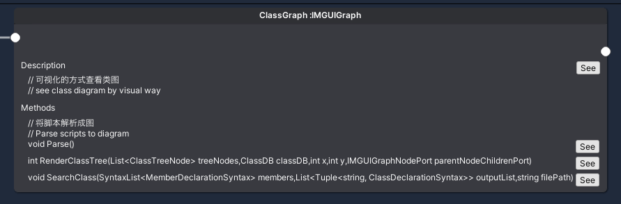

DocKit supports writing documents as well as generating simple inherited class diagrams from code in a directory

It's very simple to use

Just right-click on any directory that has code and select @dockit /Create Class Graph to do the following

After creation, it looks like this:

We first look at it in Inspector below

We can see the parse button, click it and the result is as follows:

You can see that all the classes in the current directory are listed under the parse button.

A new window also opens as follows:

So now we have our class diagram.

A class diagram is just a simple class diagram, where you can see an overview of a class and a simple inheritance relationship.

For the ClassGraph class in the figure, we can click the see button to open the code editor as follows:

Let's write comments about the class method, as follows.

Then we go back to the class diagram editor, right-click to reload, and see our ClassGraph class diagram look like this

This way you can write some comments while reading the source code.

