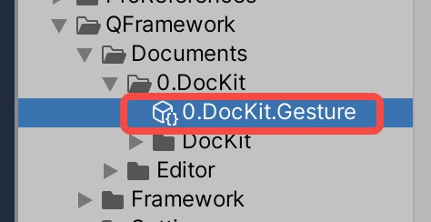
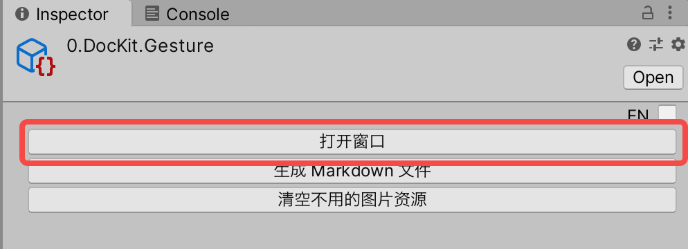

## DocKit 基本使用

如果看到这个节点，说明已经打开了 DocKit 编辑器
所有的 QF Pro 的模块均用此方式提供文档

### 0. 鼠标滚轮可以放大缩小

### 1. 双击编辑器任意位置可以切换全屏/窗口

### 2. Alt + 鼠标左键/按下滚轮键 可进行移动

### 3. 双击 DocKit 文件也可以打开此编辑器 如下

### 4. 也可以通过 DocKit 文件的 Inspector 窗口打开 如下

### 5. 开始享受工作吧！

### 6. ctrl/cmd + e  或者菜单 QFramework/PackageKit 可以打开刚才的 QFramework Pro 的主窗口

### 7. QF Pro 目前还处在非常早期的阶段，如果出现一些问题，请尝试右键 DocKit 编辑器任意位置，选择 重新加载 即可重新加载此图

### 8. 常规的 复制、粘贴、选框、分组等功能都支持 这里不再赘述

