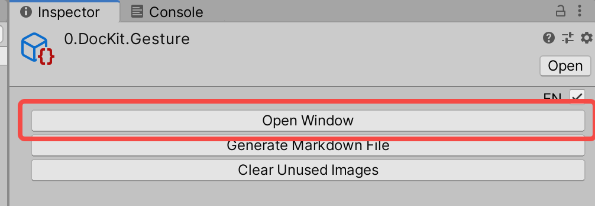

## DocKit Basic Usage

If you see this node, the dockit editor has been opened
All QF Pro modules provide documentation in this way

### 0. The mouse wheel can zoom in and out of the editor

### 1. Double-click anywhere in the editor to switch between full screen/window

### 2. Alt + left mouse button / press the wheel button to move

### 3. Double-click the DocKit file to open this editor as follows

### 4. Also can open by inspector as follows

### 5. Enjoy!

### 6. Ctrl / CMD + e or menu qframework / packagekit can open the main window of qframework Pro just now

### 7. QF Pro is still in a very early stage. If there are some problems, please try to right-click anywhere in the DocKit editor and select Reload to reload this diagram

### 8. Conventional copy, paste, box selection, grouping and other functions are supported, which will not be repeated here

