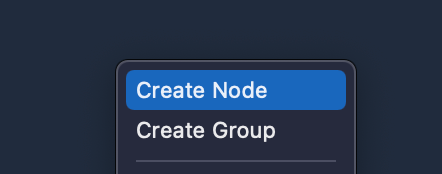
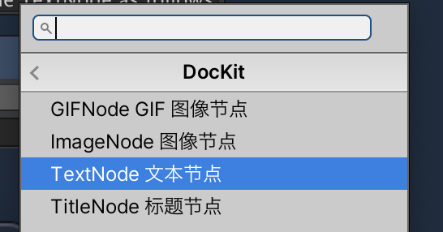
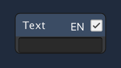

## How do I edit a document?

### 0. How to create a text node?

* Right click to create text node as follows

* in the window that opens, select the DocKit/TextNode TextNode as follows

* The results are as follows

Hello DocKit

* You can enter any editing content in the input field. The author has written below

* This is the DocKit text node creation process, and that's it

### 1. How to create image nodes?

* The method of creation is the same as that of text nodes, which will not be described here

* click... The button can import images from the desktop, so it is best to use a screenshot software when writing documents.

* OK image node basic use is introduced, here remind, all nodes support Chinese and English switch, if you need to use this function, please experience.

* The image node may cause many unused image resources, so it provides a one-click function to empty useless resources
Click on the "Clear Unused Images" button in the Inspector of the DocKit file.

* How do I change the size of the image node? Modify the size of the original image file

