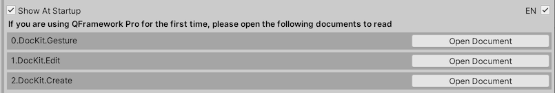

## In the Project view, right-click anywhere and select Create/DocKit/Create Document Graph- Create Document to Create the Document as follows

## Once created, press CTRL + E to see the document automatically displayed in the QFramework main window, as shown below

